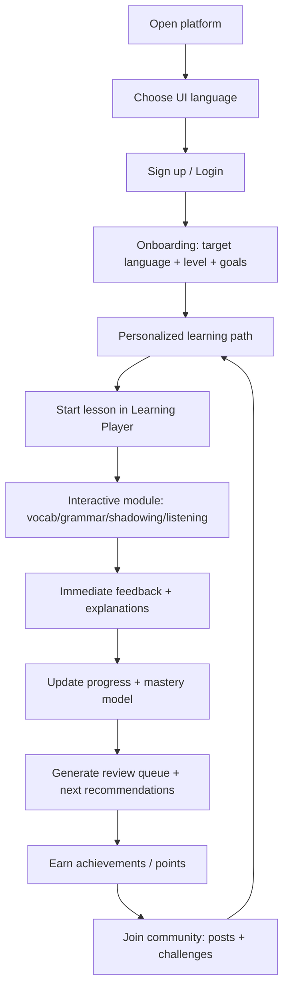

## 1. Product Overview
An online, multilingual education platform that delivers an immersive language-learning experience across levels, skills, and community-driven motivation.
- Solves fragmented learning by combining structured courses, interactive practice, personalized paths, and social incentives in one place
- Targets self-learners, exam-prep learners, and busy professionals learning English, Japanese, Korean, and other mainstream languages

## 2. Core Features

### 2.1 User Roles
| Role | Registration Method | Core Permissions |
|------|---------------------|------------------|
| Learner | Email/password, Google/Apple (optional) | Enroll in courses, complete modules, track progress, join community, earn achievements |
| Admin | Invitation-based | Create/manage courses, manage moderation, configure achievements/challenges, review analytics |

### 2.2 Feature Module
1. **Home / Onboarding**: value proposition, supported UI languages, quick placement entry, recent activity
2. **Auth**: registration, login, password reset, basic profile setup
3. **Course Catalog & Levels**: language selection, level system (e.g., A1–C2 / JLPT N5–N1), goals, course enrollment
4. **Learning Player (Interactive Modules)**:
   - Vocabulary memorization (spaced repetition)
   - Grammar exercises (drills + explanations)
   - Oral shadowing (script + recording + playback + pace control)
   - Listening training (clips + comprehension + dictation)
5. **Progress Tracking**: skill mastery, streaks, lesson completion, time spent, module-level analytics
6. **Personalized Learning Path**: recommendations based on level, goals, weak skills, and recent performance
7. **Community & Incentives**: posts, study rooms/challenges, leaderboards, badges/achievements, reporting/moderation
8. **Admin Console**: course authoring, exercise builder, moderation, achievement configuration

### 2.3 Page Details
| Page Name | Module Name | Feature description |
|-----------|-------------|---------------------|
| Landing | Language switch | UI language selector (English, Japanese, Korean, and extensible) with persistent preference |
| Landing | Course preview | Sample lessons and module demos with “Try now” entry |
| Sign up / Login | Auth forms | Email/password sign up, login, reset password, social login optional |
| Onboarding | Placement & goals | Pick target language, current level (self-assess + short placement), goals (speaking/listening/exam) |
| Dashboard | Daily plan | Personalized “Today” learning block: recommended lesson + micro-practice set |
| Dashboard | Progress snapshot | Streak, level progress bar, skill radar (vocab/grammar/listening/speaking) |
| Catalog | Level system | Browse by language → level → course; filters for duration, goal, difficulty |
| Course Detail | Curriculum | Units/lessons list; prerequisites; estimated time; enrollment and resume learning |
| Learning Player | Lesson navigation | Step-based modules with checkpoints and “review weak items” entry |
| Vocab Module | SRS practice | Flashcards, typing test, audio, example sentences, spaced repetition schedule |
| Grammar Module | Exercises | Multiple choice, fill-in, reorder, error-spotting, immediate feedback with explanation |
| Shadowing Module | Record & compare | Script + audio; speed control; record; A/B playback; optional waveform |
| Listening Module | Comprehension | Short clips; questions; dictation; replay-by-segment; difficulty toggles |
| Progress | Analytics | By course/skill/time; weak-skill breakdown; export/share progress card |
| Recommendations | Learning path | Suggested next lessons, review queue, “focus mode” for weakest skill |
| Community | Feed | Posts, tips, questions; likes; comments; content reporting |
| Community | Challenges | Weekly challenges, points, milestone badges, leaderboard (global + friends) |
| Profile | Achievements | Badges, certificates, stats, goal settings, UI language preference |
| Admin | Course builder | Manage languages/levels/courses/lessons; exercise templates; media upload |
| Admin | Moderation | Reports queue, post removal, user restriction, challenge configuration |

## 3. Core Process
Main learning flow:
- User signs up → chooses UI language → sets target learning language and level → receives a personalized “Today” plan
- Learner completes interactive modules inside lessons; each interaction updates progress and mastery scores
- Weak items automatically enter a review queue; recommendations adapt to performance and goals
- Community challenges and achievements incentivize consistent practice and peer feedback

## 4. User Interface Design
### 4.1 Design Style
- Visual direction: immersive, “studio-like” learning environment with focused reading surfaces and high-contrast audio controls
- Primary colors: deep ink background with warm paper surfaces; accent colors per target language (configurable)
- Buttons: pill or soft-rect with subtle depth; high-contrast states for accessibility
- Typography: distinctive display font for headings + highly legible body font; strong hierarchy for lesson steps
- Layout: desktop-first, split-pane learning player (content + practice + progress); card-based catalog and community
- Icon style: minimal line icons + lightweight micro-illustrations for achievements (consistent set)

### 4.2 Page Design Overview
| Page Name | Module Name | UI Elements |
|-----------|-------------|-------------|
| Dashboard | Daily plan | Large “Start” CTA, lesson stepper preview, streak badge, subtle motion on hover |
| Learning Player | Module steps | Left navigation, center practice canvas, right progress panel, sticky audio controls |
| Vocab | Flashcards | Flip animation, “show example” drawer, audio button, spaced repetition indicator |
| Shadowing | Recorder | Transcript highlighting, speed selector, record button with waveform, A/B playback |
| Progress | Analytics | Skill radar, streak calendar, breakdown chips, shareable progress card |
| Community | Challenges | Progress meters, leaderboard cards, badge gallery, report/flag controls |

### 4.3 Responsiveness
- Desktop-first: optimized for long sessions and split-pane learning player
- Mobile-adaptive: condensed navigation, single-column player, large touch targets, offline-friendly review queue (optional)
- Accessibility: keyboard navigation for exercises, captions for audio, color-contrast compliant theming

