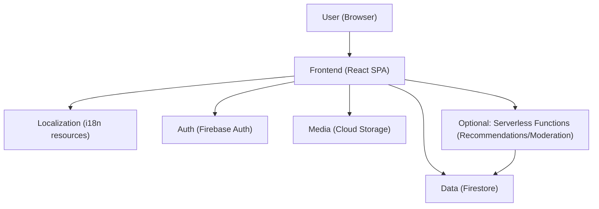
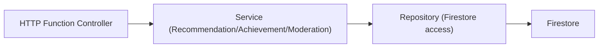
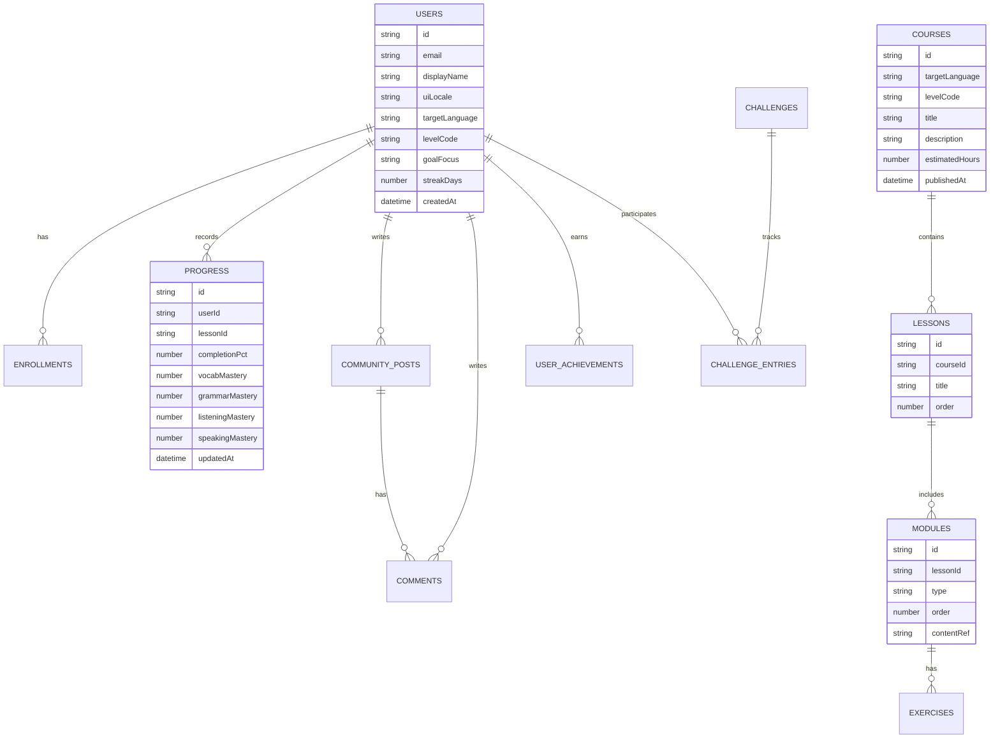

## 1. Architecture Design


## 2. Technology Description
- Frontend: React@18 + TypeScript + Vite + tailwindcss@3
- State/Data: React Query (or equivalent) + Firebase SDK caching; local persistence for review queue (IndexedDB) optional
- Internationalization: i18next + ICU message formatting; content localization per UI language
- Backend: Firebase (Auth + Firestore + Storage); Optional Firebase Cloud Functions for compute-heavy logic
- Initialization Tool: Vite

## 3. Route Definitions
| Route | Purpose |
|-------|---------|
| / | Landing + UI language switch |
| /auth/login | Login |
| /auth/signup | Registration |
| /onboarding | Target language, level placement, goals |
| /app | Authenticated shell (dashboard entry) |
| /app/dashboard | Daily plan + recent activity |
| /app/catalog | Browse languages/levels/courses |
| /app/courses/:courseId | Course details + curriculum |
| /app/learn/:lessonId | Learning Player (module runner) |
| /app/progress | Progress analytics |
| /app/recommendations | Personalized learning path |
| /app/community | Feed |
| /app/community/challenges | Challenges + leaderboards |
| /app/profile | Profile + achievements + settings |
| /admin | Admin console (role-gated) |

## 4. API Definitions (Optional backend functions)
If implemented, these are serverless endpoints to keep client logic minimal and prevent tampering.

### 4.1 Types (TypeScript)
```ts
export type UiLocale = "en" | "ja" | "ko" | string;

export type TargetLanguage = "en" | "ja" | "ko" | string;

export type LevelCode =
  | "A1" | "A2" | "B1" | "B2" | "C1" | "C2"
  | "N5" | "N4" | "N3" | "N2" | "N1"
  | string;

export type ModuleType = "vocab" | "grammar" | "shadowing" | "listening";

export interface RecommendationRequest {
  userId: string;
  targetLanguage: TargetLanguage;
}

export interface RecommendationResponse {
  nextLessonIds: string[];
  reviewItemIds: string[];
  rationale: string[];
}
```

### 4.2 Endpoints (if Cloud Functions used)
| Method | Path | Purpose |
|--------|------|---------|
| POST | /api/recommendations | Generate next steps + review queue based on progress |
| POST | /api/achievements/evaluate | Evaluate achievements after session completion |
| POST | /api/community/moderate | Apply moderation rules, rate limits, and abuse checks |

## 5. Server Architecture Diagram (if backend exists)


## 6. Data Model
### 6.1 Data Model Definition


### 6.2 Data Definition (Firestore-oriented)
Firestore collections (suggested):
- users/{userId}
- courses/{courseId}
- courses/{courseId}/lessons/{lessonId}
- lessons/{lessonId}/modules/{moduleId}
- users/{userId}/enrollments/{courseId}
- users/{userId}/progress/{lessonId}
- users/{userId}/reviewQueue/{itemId}
- communityPosts/{postId}
- communityPosts/{postId}/comments/{commentId}
- achievements/{achievementId}
- users/{userId}/achievements/{achievementId}
- challenges/{challengeId}
- challenges/{challengeId}/entries/{userId}

Security and integrity rules (high level):
- Only the authenticated user can read/write their own progress and review queue
- Course content is read-only for learners; write access only for admins
- Community write operations are rate-limited; moderation flags are write-once per user per post
- Leaderboards and achievements should be computed server-side (or validated) if rewards have real value

